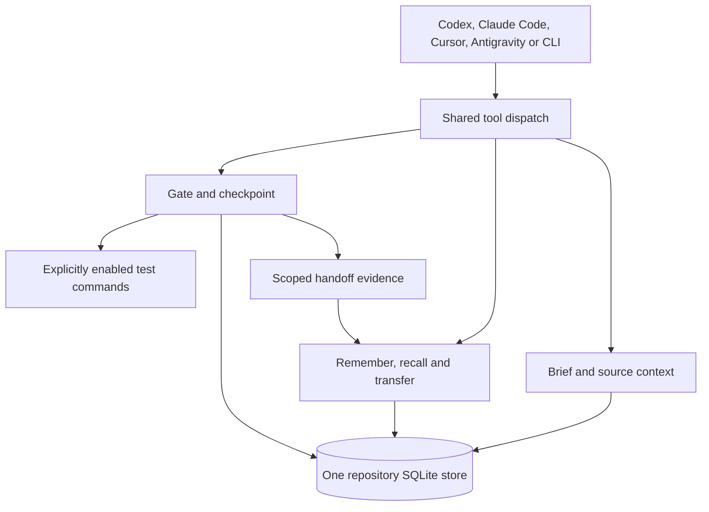

# Weftgate design

Weftgate is one local context, memory and verification engine for coding agents.
The public package contains the everyday Mnemo memory workflow alongside the gate:
start a task with `brief`, save a decision with `remember`, check code connections,
and leave a scoped `handoff` for the next session. A second package is unnecessary.

The name combines the crossing thread in a weave with a verification gate. The
project is licensed under Apache-2.0. This document describes the implemented
architecture; [the context and memory contract](ADDENDUM-context-and-memory.md)
provides the detailed invariants for its newer surfaces.

## What problem it solves

Agents can lose project decisions between sessions and produce code whose parts do
not connect. Weftgate provides small source references and explicit notes, then
checks supported relationships against the project's own declarations. It makes
missing evidence visible instead of inventing certainty or a token-savings number.

The coding agent still reasons, reads code, edits and repairs. Weftgate supplies
context and observations. It does not provide a model, orchestrate arbitrary agents,
execute an autonomous repair loop or guarantee application correctness.

## One local architecture

CLI and the standard-library stdio MCP server use the same functions. A `Session`
loads repository configuration, discovers enabled oracles and synchronizes indexes.
SQLite holds per-oracle tables, source hashes, changed-node history, notes and
historical handoff snapshots. Nested transactions roll back partial operations.
The default store is repository-scoped under the user cache directory. Portable
exports provide deliberate backups; cache deletion also removes its saved notes.

| Component | Responsibility |
| --- | --- |
| `config`, `store`, `registry`, `oracle` | Configuration, incremental indexes and plugin contract |
| `change`, `gate`, `suggest` | Parse changes, check claims, aggregate verdicts and suggest repairs |
| `honesty`, `workflow` | Scoped outcome evidence and current-tree checkpoints |
| `context`, `payload` | Source pointers and bounded UTF-8 responses |
| `memory`, `recall`, `privacy` | Grounded claims, lexical notes, freshness and best-effort redaction |
| `transfer` | Explicit read-only Mnemo import and portable note export/import |
| `brief` | Combined task context and historical handoff snapshots |
| `brain`, `cli`, `mcp_server` | Common operations and matching external surfaces |
| `setup`, `hooks` | Preserve project configuration and emit client-specific gate responses |
| `eval`, `selftest` | Deterministic fixture mutation, audits and offline validation |

Core operations require only Python's standard library and make no network calls.
Optional extras and oracle plugins may add capabilities. Explicit test execution
runs repository code with its own side effects; plugin code is trusted executable
code selected by configuration, not sandboxed data.

## Verification invariant

**Block only on a positive, machine-checkable falsehood.**

A `Claim` names a relationship and its location. Oracles extract claims from a
change or receive structured assertions. Each returns a `Finding` with a reason,
a verdict and optional suggestions. The aggregate gate rejects if any eligible
finding rejects, otherwise reviews if any reviews, otherwise accepts.
`UNVERIFIABLE` findings remain visible but never cause a block.

An absent index, optional capability, dynamic reference or uncertain declaration
set cannot establish a falsehood. Prose-derived claims are soft. `ACCEPT` may mean
nothing checkable was found; it is not a claim that every program behavior works.
Outcome claims never receive `PROVEN` without matching machine-checkable evidence.

The shipped oracles cover environment-variable declarations, Python/Node dependency
imports, and static FastAPI/Starlette route wiring. There is no claim of universal
schema, migration, feature-flag, authorization or runtime dispatch verification.
Each added oracle needs a true positive, true negative and a soft uncertainty case,
atomic index updates and CLI/MCP parity. See [ORACLES.md](ORACLES.md).

## Memory that keeps its evidence

Explicit notes are bounded prose plus optional file, env, route, import or symbol
claims. Proven false claims refuse a write; unavailable evidence is retained for
review. Text itself remains untrusted and semantically unverified.

Anchors retain their original hashes. Reads re-check them without rewriting that
evidence. Changed, missing or uncheckable anchors hide notes by default until the
user reviews and explicitly replaces them. Imports preserve this lifecycle; a new
checkout never manufactures fresh grounding for an old note. Import declarations
are hashed conservatively, not used as proof of installed package behavior.

Mnemo's local lexical memory, grounding and redaction designs are adapted into this
package. The importer reads selected reviewed records without importing Mnemo's
Python modules or enabling capture. Legacy transcript distillation, embeddings and
team federation remain separate opt-in workflows. See [MEMORY.md](MEMORY.md) and
[MNEMO-MIGRATION.md](MNEMO-MIGRATION.md).

## Context and handoffs

`brief` interleaves relevant current notes with source references under one response
budget. Focused `card`, `resolve` and `neighbors` calls remain available. Results
contain pointers and static relationships, not complete file bodies or env values.
The default budget is 1,500 estimated tokens enforced as 6,000 UTF-8 JSON bytes.
Token estimates are not exact model tokenization or measured savings.

`checkpoint` checks current staged, unstaged and untracked changes. Configured tests
run only with explicit opt-in and an allowlist. Tree fingerprints detect source
changes during execution. `handoff` saves a summary with a historical snapshot of
that checkpoint; later recall reports whether the tree still matches. Re-run tests
before the next handoff even when an old fingerprint matches.

Editor hooks request bounded repair continuations for proven failures. Client
trust and policy remain authoritative. A hook cannot certify every editor build or
force all paths through a gate. Required CI checks and branch protection provide
the repository merge boundary. See [WORKFLOWS.md](WORKFLOWS.md).

## Validation and limits

The tests cover deterministic verdicts, rollback, stale-source suppression,
malformed migration input, read-only source access, secret scrubbing, CLI/MCP parity,
byte budgets, hook protocols and observed test outcomes. CI runs supported Python
versions on Linux plus macOS and Windows, a core-only environment and packaging.
[VALIDATION.md](VALIDATION.md) records completed runs and release evidence.

Mutation scores are fixture results, not field accuracy. Static coverage remains
limited to implemented contracts. Token optimization means bounded useful context
and observable payload costs; any savings claim needs a defined task, baseline,
model and equal-quality outcome. Broader language/framework coverage, semantic
retrieval and remote collaboration require separately designed capabilities.
